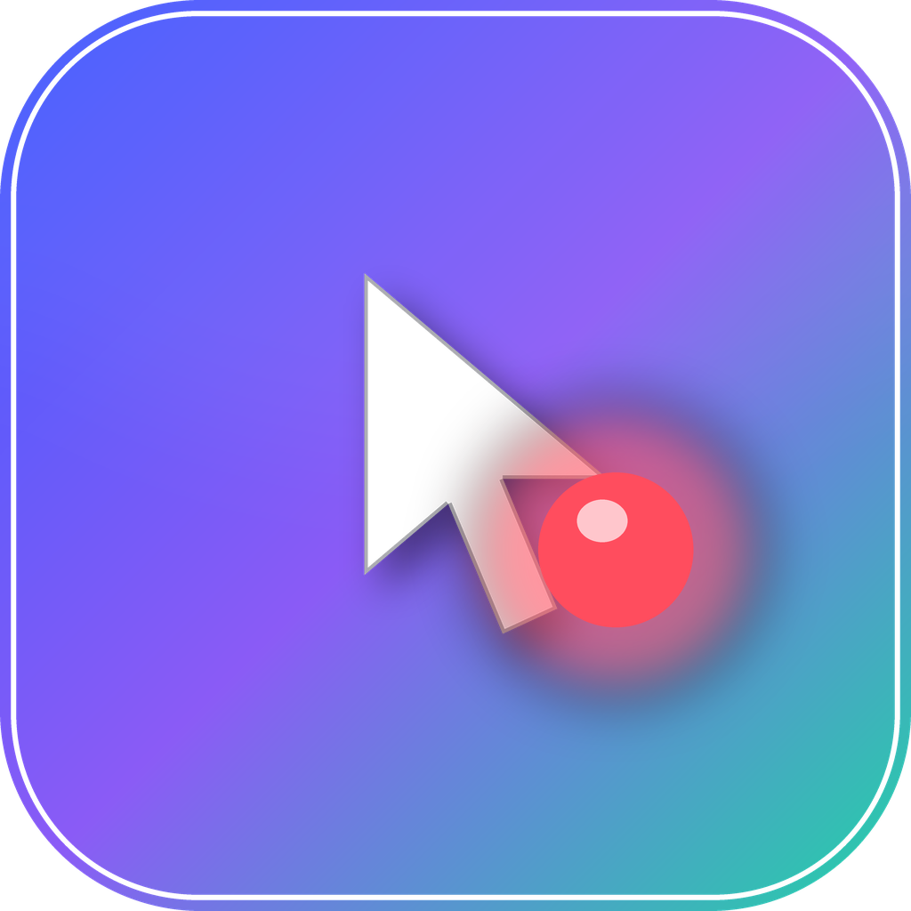

<div align="center">



# AutoAction Acmigo

**Profesionalni alat za snimanje i reprodukciju akcija miša i tastature — globalno, u bilo kojoj aplikaciji.**

Snimi šta radiš na računaru (klikove, pomjeranje miša, kucanje, prečice), pa to pusti na *Play* koliko god puta hoćeš — u Wordu, u browseru, bilo gdje. Sa mogućnošću da **prekineš reprodukciju u svakom trenutku**.

Napravljeno u **Electronu** • Windows instalacija (NSIS) + portabilna verzija • moderna ikonica

</div>

---

## ✨ Šta program radi

- 🎥 **Globalno snimanje** — hvata miš **i** tastaturu na nivou cijelog sistema, ne samo unutar svog prozora. Kucanje u Wordu, prečice (Ctrl+C, Ctrl+V…), sve se snima.
- ▶️ **Vjerna reprodukcija** — svaki pritisak tastera se ponavlja pojedinačno, pa se ponaša isto kao da ti stvarno kucaš. Radi u svakoj aplikaciji.
- ⏹️ **STOP u svakom trenutku** — veliko STOP dugme **ili** globalna prečica `Escape` dok reprodukcija traje. Nema zaglavljenih tastera (sve se uredno otpušta).
- 🔁 **Ponavljanje i petlja** — pusti X puta ili beskonačno (dok ne pritisneš STOP).
- ⏩ **Brzina reprodukcije** — od 0.25× do 4×.
- ⏱️ **Odbrojavanje prije starta** — da stigneš da se prebaciš na pravi prozor (sa velikim overlay-om).
- 🎯 **Kontekstno svjesna reprodukcija (Pametno)** — makro pamti u kojoj je aplikaciji snimljen; pri puštanju je sam dovede u prvi plan, a ako nije pokrenuta — pokrene je i sačeka da se učita. Radi bez obzira gdje se trenutno nalaziš.
- 🌐 **Pronalazak taba** — ako je makro snimljen u pretraživaču, sam nađe baš onaj tab (preko ugrađene pretrage tabova), a ne samo program.
- 📐 **Prati prozor** — klikovi se prilagode ako je prozor pomjeren ili druge veličine nego pri snimanju.
- ✏️ **Editor koraka** — obriši pogrešan klik, doštelaj pauzu ili ubaci čekanje bez ponovnog snimanja; može i ukloniti sve pomjeraje miša odjednom.
- 📚 **Biblioteka makroa** — sačuvaj, preimenuj, obriši, izvezi/uvezi kao JSON fajl.
- 🎯 **Vlastita prečica za svaki makro** — dodijeli bilo koju tipku (npr. `F2`, `Ctrl+Shift+K`) baš tom makrou; pritisak je pokreće bilo kad, **čak i dok je program u tray-u**. Npr. `F2` → makro koji otvara Notepad, `F3` → makro koji otvara stranicu.
- ⌨️ **Globalne prečice** — `F6` snimanje, `F7` reprodukcija, `Escape` stop (aktivan samo tokom reprodukcije).
- 🖥️ **Rad u sistemskoj paleti (tray)** — dugme **minimiziraj (–)** može sakriti program u tray (opcija u Podešavanjima); **X uvijek potpuno zatvara program**.
- 🎨 **Prelijep tamni interfejs** — akcenatska boja cijelog programa reaguje na stanje: mirno (indigo), snimanje (crvena), odbrojavanje (žuta), reprodukcija (mint zelena).

---

## ⭐ Najlakši način — GitHub sam kompajluje (bez Windowsa i alata)

Projekat već sadrži **GitHub Actions** workflow (`.github/workflows/build.yml`) koji od projekta pravi gotov Windows `.exe` **na GitHub-ovim mašinama**. Ne treba ti ni Windows računar, ni build alati — samo nalog na GitHubu.

1. **Postavi projekat na GitHub** (uputstvo je niže u sekciji *Kako da staviš projekat na GitHub*).
2. Otvori repozitorij na github.com → kartica **Actions**.
3. Ako te pita, klikni **"I understand my workflows, go ahead and enable them"**.
4. Lijevo izaberi workflow **"Build Windows"** → dugme **"Run workflow"** → **Run**.
5. Sačekaj par minuta da se build završi (zelena kvačica ✅).
6. Uđi u taj build → sekcija **Artifacts** dole → skini **`AutoAction-Acmigo-Windows`**. Unutra su instaler i portabilni `.exe`. 🎉

### Automatski Release sa .exe fajlovima

Ako gurneš **tag**, workflow ne samo da napravi build nego i objavi **Release** sa zakačenim `.exe` fajlovima (idealno za dijeljenje):

```bash
git tag v1.0.0
git push origin v1.0.0
```

Nakon toga fajlovi su na `github.com/KORISNIK/autoaction-acmigo/releases`.

> 💡 Ovaj workflow se pokreće i automatski na svaki `push` na `main`, pa uvijek imaš svjež build u Actions kartici.

---

## 🧰 Preduslovi (samo ako kompajliraš lokalno)

Da bi od projekta napravio gotov `.exe`, treba ti **Windows** računar i:

1. **Node.js 18+** — [nodejs.org](https://nodejs.org) (preporuka: LTS verzija)
2. **Alati za build nativnih modula** (program koristi nativne module za globalno hvatanje/simulaciju):
   - **Visual Studio Build Tools** sa opcijom *"Desktop development with C++"*, **ili**
   - jednostavnije: u PowerShellu kao Administrator pokreni:
     ```powershell
     npm install --global windows-build-tools
     ```
   - **Python 3** (obično dođe uz gornje, ako ne — [python.org](https://python.org))

> 💡 Ako samo želiš da **koristiš** program (ne da ga kompajliraš), preskoči ovo — pusti nekog s Windowsom da odradi build ispod, pa podijeli gotov instaler iz `release/` foldera.

---

## 🚀 Kompajliranje — korak po korak

Otvori terminal (PowerShell ili CMD) u folderu projekta i redom:

```bash
# 1) Instaliraj sve zavisnosti
npm install

# 2) Prekompajliraj nativne module za tvoju verziju Electrona
npm run rebuild

# 3) (opciono) Pokreni program da probaš prije build-a
npm start

# 4) Napravi Windows instaler + portabilnu verziju
npm run build:win
```

Kad se `build:win` završi, gotovi fajlovi su u folderu **`release/`**:

- `AutoAction Acmigo Setup 1.0.0.exe` — **instalacija** (možeš birati folder, pravi prečice na desktopu i u Start meniju)
- `AutoAction Acmigo 1.0.0.exe` — **portabilna** verzija (pokreće se bez instalacije)

To je taj gotov softver za skidanje. 🎉

### Druge korisne komande

| Komanda | Šta radi |
|---|---|
| `npm start` | Pokreće program u razvojnom režimu |
| `npm run pack` | Pravi raspakovan build (bez instalera) za brzu probu |
| `npm run build:portable` | Samo portabilni `.exe` |
| `npm run dist` | Build prema podrazumijevanoj konfiguraciji |

---

## 📤 Kako da staviš projekat na GitHub

```bash
# u folderu projekta
git init
git add .
git commit -m "AutoAction Acmigo — prva verzija"

# napravi prazan repozitorij na github.com, pa:
git remote add origin https://github.com/KORISNIK/autoaction-acmigo.git
git branch -M main
git push -u origin main
```

`node_modules/` i `release/` se **ne šalju** na GitHub (već su u `.gitignore`) — svako ko skine projekat sam pokrene `npm install` i `npm run build:win`.

> 💡 Ako želiš da ponudiš gotov `.exe` za skidanje: na GitHubu napravi **Release**, pa uz njega zakači fajlove iz `release/` foldera.

---

## 🗂️ Struktura projekta

```
autoaction-acmigo/
├── .github/workflows/
│   └── build.yml          # GitHub Actions — automatski build .exe na GitHubu
├── build/                 # ikonice + skripta za generisanje ikone
│   ├── icon.ico           # ikonica aplikacije (Windows)
│   ├── icon.png           # master ikonica (1024px)
│   ├── tray.png           # ikonica za sistemsku paletu
│   └── make_icon.py       # Python skripta koja pravi ikonice
├── src/
│   ├── main/              # glavni (Electron) proces
│   │   ├── main.js        # orkestracija, prozor, tray, IPC, prečice
│   │   ├── recorder.js    # globalno snimanje (uiohook-napi)
│   │   ├── player.js      # reprodukcija (@nut-tree-fork/nut-js), prekidiva
│   │   ├── keymap.js      # mapiranje kodova tastera/dugmadi
│   │   └── storage.js     # čuvanje makroa i podešavanja na disk
│   ├── preload/
│   │   └── preload.js     # sigurni most ka interfejsu (contextBridge)
│   └── renderer/          # interfejs
│       ├── index.html
│       ├── styles.css     # tamna tema koja reaguje na stanje
│       ├── renderer.js
│       └── assets/logo.png
├── package.json           # zavisnosti + electron-builder konfiguracija
├── .gitignore
├── LICENSE
└── README.md
```

---

## ⚙️ Kako radi (ukratko)

- **Snimanje** koristi `uiohook-napi` da globalno osluškuje miš i tastaturu na nivou operativnog sistema.
- **Reprodukcija** koristi `@nut-tree-fork/nut-js` da simulira te iste događaje. Svaki `keydown`/`keyup` se izvršava zasebno, pa se prečice i kucanje ponašaju identično kao original — zato radi i u Wordu i svugdje drugdje.
- **STOP** — reprodukcija provjerava „zastavicu za prekid" prije svakog koraka i svake iteracije petlje; na prekid otpušta sve držane tastere/dugmad da ništa ne ostane „zaglavljeno".
- Makroi se čuvaju kao JSON u `%APPDATA%/AutoAction Acmigo/`.

---

## 🩹 Rješavanje problema

- **Program se pokrene ali javlja da nativni moduli nedostaju** → nisi pokrenuo `npm run rebuild`, ili nisu instalirani C++ build alati (vidi *Preduslovi*). Program prikaže žuto upozorenje sa uputstvom.
- **`npm install` puca na nativnim modulima** → provjeri da imaš Visual Studio Build Tools (C++) i Python 3, pa ponovo `npm install` → `npm run rebuild`.
- **GitHub Actions build puca sa `unsupported version: 18` / `Could not find any Visual Studio`** → GitHub-ov `windows-latest` sada nosi Visual Studio 2026 (v18), koji `node-gyp` ne prepoznaje. Zato workflow koristi `runs-on: windows-2022` (Visual Studio 2022). Ako si ručno mijenjao workflow, vrati na `windows-2022`.
- **Antivirus reaguje** → normalno je da alati koji simuliraju miš/tastaturu privuku pažnju antivirusa; program je bezopasan i otvorenog koda.
- **Prečice se ne aktiviraju** → neka druga aplikacija ih je možda zauzela; promijeni ih u kodu (`storage.js`, `defaultSettings.hotkeys`).

---

## 📄 Licenca

MIT — vidi [LICENSE](LICENSE). Slobodno koristi, mijenjaj i dijeli.

---

<div align="center">

Napravljeno s pažnjom — **AutoAction Acmigo** ⚡

</div>
